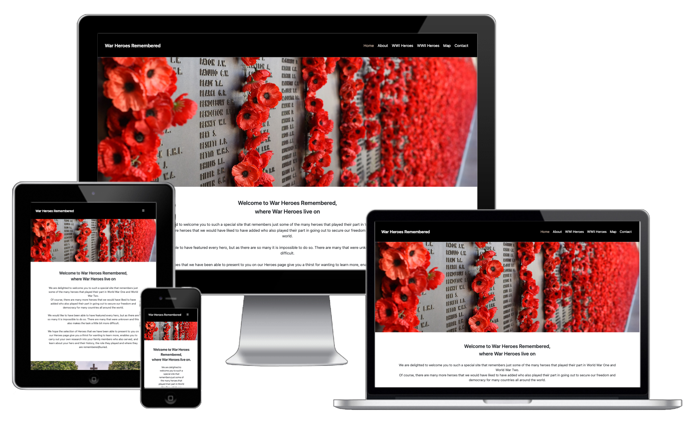

# War-Heroes-Remembered

Based on my original [War Heroes Remembered](AndrewH1188/war-heroes-remembered-ms2) project that I produced for my second Milestone Project with Code Institute, I have decided that it is time to expand and develop this great project further, whilst keeping the respectful presence that this site has. 

## Showcase

My original Code Institute War Heroes Remembered Milestone 2 website can be found [here](https://andrewh1188.github.io/war-heroes-remembered-ms2/) and my newly developed site can be found [here](https://andrewh1188.github.io/War-Heroes-Remembered/). 

Although visually there maybe slight differences between the two, the main difference is in code base. Using SCSS that is compiled down to CSS is a start with the nesting and also separating stylesheets so that elements are easier to work with.

There is also the notable addition of the World War Two page which is featured from the Heroes dropdown in the navigation bar. 
There are further additions to make items such as the show more/less button function on the page as originally intended.

## Table of Contents
1. [User Experience UX](#user-experience-ux)
    * [User Stories](#user-stories) 
    * [As a new / first time user](#new-first-time-user)
    * [Returning Visitor Goals](#returning-visitor-goals)
    * [Frequent User Goals](#frequent-user-goals)
    * [User Customer Goals](#user-goals)
    * [Business Goals](#business-goals)
    * [Scope](#scope) 
    * [Structure](#structure) 
    * [Design](#design)
    * [Imagery](#imagery)
    * [Wireframes](#wireframes)
2. [Features](#features)
    * [Existing-features](#existing-features)
    * [Future-features](#future-features)
3. [Technologies and Languages Used](#technologies)
    * [Other Resources](#other-resources) 
    * [Social Media](#social-media)
4. [Testing](#testing)
    * [Testing User Stories](#testing-user-stories)
    * [Implementation](#implementation)
    * [Results](#results)
    * [Bugs](#bugs)
5. [Deployment](#deployment)
6. [Credits](#credits)
    * [Content](#content)
    * [Media](#media)
    * [Acknowledgments](#acknowledgments)

## User Experience UX

## User stories

#### As a first time user I would expect the questions asked would be:

#### Returning Visitor Goals 

#### As a returning user I would expect the questions asked would be:

#### Frequent User Goals

#### As a frequent user I would expect the questions asked would be:

#### User Goals

#### Site Goals 

#### Strategy
Having completed this original website as my second milestone project with Code Institute and identifying improvements along the way, I have revisited this special website in order to make minor updates. Since my original milestone project where I had 4 pages and two items on each, I have split items like the Map onto its own page, as well as added a page for World War Two Heroes. The original fonts and colours have been kept as these are the "brand's" signature. Original images have been kept, but have been made smaller in height so a user isn't scrolling further to get past an image. There have been additional images that have been used on the WWII Heroes page, in the way of a header image and the heroes themselves.

#### Scope

#### Structure

#### Skeleton

#### Surface

## Design

## Imagery
* I designed the Favicon in [Adobe Illustrator](https://www.adobe.com/uk/products/illustrator.html) then exported this as a jpg in order to add this into the images folder without any issues. I created the Favicon as a larger size than the usual that is required as this makes the resolution when displayed in the browser view higher resolution than the normal favicon size which appears pixilated. 
* The great image used as the Hero image on the home page had to change from the one on my initial design because I couldn’t find where I originally downloaded this from, so couldn’t credit the person that took this photograph. I found the new and very similar image on [Adobe Stock](https://stock.adobe.com/uk/) that I am able to credit.
1. [Poppies on the remembrance wall](https://stock.adobe.com/images/poppies-on-the-remembrance-wall/231816455?asset_id=231816455)
 * file #: 231816455
 * Photo uploaded to Adobe Stock by Vince
I selected this as the Hero image for the Home page (index.html) as it is a strong, complementary, respectful image to use as the remembrance wall has many poppies in to the fallen heroes. This image is complemented by the choice of colours that I have used.
2. [Graveyard with monument in Normandy](https://pixy.org/search.php?search=Graveyard+with+monument+in+Normandy)
This is the image that I have used on the home page (index.html) above the About Us (index.htm#aboutl) section. I have used this image to section off the about us section and also as it is in keeping with the theme of the site and what this is about which is remembering as well as learning about our War Heroes. 
3. [Colleville-Sur-Mer Cemetery D-Day United States](https://pixabay.com/photos/colleville-sur-mer-cemetery-d-day-2139248/) 
 * Photo uploaded to Pixabay by herb1979
This image has been downloaded from [Pixabay](https://pixabay.com/) and used on the Heroes page.
[memorial, cemetery, military, d-day, normandy, graveyard, monument, peace, memory, landmark, patriotic](https://www.pikist.com/free-photo-vsecq)
4. [Ramscappelle Road Military Cemetery](https://stock.adobe.com/uk/images/ramscappelle-road-military-cemetery/179912388)
 * file #: 179912388
 * Photo uploaded to Adobe Stock by Kartouchken
This image has been used for the Heroes that unfortunately have no photo of them available. This image has also been used on Facebook, Twitter and Instagram for the Heroes as well.

#### WWI Heroes Page 1 image sources
5. [Private Richard Spearink](https://stock.adobe.com/uk/images/ramscappelle-road-military-cemetery/179912388)
 * file #: 179912388
 * Photo uploaded to Adobe Stock by Kartouchken
6. [Private Frederick Spearink](https://www.ww1cemeteries.com/uploads/7/4/4/5/74452945/helles-mem-spearink_orig.png)
7. [Thomas Banister](https://livesofthefirstworldwar.iwm.org.uk/lifestory/167008) Source information ID: 9322132
8. [Second Lieutenant Sidney Vandyke Hasluck](https://www.iwm.org.uk/collections/item/object/205300873) Imperial War Museums credit © IWM HU 123053.
9. [Nurse Elizabeth McMath (Daisy) Warnock](https://www.iwm.org.uk/collections/item/object/205381399) Imperial War Museums credit: © IWM WWC D13-H2-74.
10. Private Thomas Phillips - My own photo taken on my iPhone 11 at the Huthwaite Cemetery Cenotaph Memorial.
11.[Leading Seaman John Sexton](https://stock.adobe.com/uk/images/ramscappelle-road-military-cemetery/179912388)
12. [Lance Corporal Arthur Norman (Barney) Allen](https://www.awm.gov.au/collection/P10687374) Item copyright: Copyright expired - public domain, Public Domain Mark This item is in the Public Domain.

#### WWI Heroes Page 2 image sources
13. [Major and acting Lieutenant-Colonel Harry Moorhouse](https://archives.passchendaele.be/en/soldier/1284) 
14. [Captain Ronald Moorhouse](https://archives.passchendaele.be/en/soldier/1286)
15. [Private John “Jack” Henry Thomas](https://www.canada.ca/en/department-national-defence/services/military-history/history-heritage/casualty-identification-military/private-john-henry-thomas.html)
16.  [Private Bertram Alec Reader](https://ww1richmond.wordpress.com/2016/05/20/boy-soldier-private-alec-reader/)
17. [Trooper George Ernest Dawkes](https://stock.adobe.com/uk/images/ramscappelle-road-military-cemetery/179912388) 
18. [Private Adolphus Jack](https://stock.adobe.com/uk/images/ramscappelle-road-military-cemetery/179912388) 
19. [Lance Corporal Norman Frank Ewart Cole](https://livesofthefirstworldwar.iwm.org.uk/lifestory/886777) 
20. [Rifleman Henry William Longman](https://livesofthefirstworldwar.iwm.org.uk/lifestory/5418305) 
21. [Remembrance Day](https://www.publicdomainpictures.net/en/view-image.php?image=12797&picture=remembrance-day)
 * Photo uploaded to PublicDomainPictures.net by Petr Kratochvil
[PublicDomainPictures.net](https://www.publicdomainpictures.net/en/)
This image has been used on the Contact Us page at the top.
22. [Poppies Field Sunset Dusk Sunlight Flowers Meadow](https://pixabay.com/photos/poppies-field-sunset-dusk-sunlight-174276/)
 * Photo uploaded to PublicDomainPictures.net by danigeza
[PublicDomainPictures.net](https://www.publicdomainpictures.net/en/)
This photo has been used on the Contact Us page in the middle and used on Facebook, Twitter and Instagram also as the main image.
23. [Facebook icon](https://fontawesome.com/v5.15/icons/facebook-f?style=brands)
24. [Twitter icon](https://fontawesome.com/v5.15/icons/twitter?style=brands)
25. [Instagram icon](https://fontawesome.com/v5.15/icons/instagram?style=brands)
26. [YouTube icon](https://fontawesome.com/v5.15/icons/youtube?style=brands)
27. [Send icon](https://fontawesome.com/v5.15/icons/paper-plane?style=regular)
28. [Back to top](https://fontawesome.com/v5.15/icons/arrow-up?style=solid)

#### WWII Heroes Page 1 image sources

#### WWII Heroes Page 2 image sources

## Wireframes

## Features

### Existing features

### Future features

## Technologies and Languages Used:

## Languages:
* [HTML5](https://en.wikipedia.org/wiki/HTML5)
* [CSS3](https://en.wikipedia.org/wiki/Cascading_Style_Sheets)
* [JavaScript](https://en.wikipedia.org/wiki/JavaScript)
* [jQuery](https://jquery.com/) 

## Libraries Frameworks and online resources:
* [Bootstrap 4.6.0:](https://getbootstrap.com/docs/4.6/getting-started/introduction/)
 Bootstrap was used to help set the navigation bar.
* Google Chrome Dev Tools: For testing purposes and to see why elements are not working as expected. Dev tools allowed me to make changes to my code in the browser to see a live representation of the website with the changes / amends that have been made.
* [Lighthouse](https://developers.google.com/web/tools/lighthouse): Was used for testing website performance, check for Performance, Accessibility, Best Practices and Search Engine Optimization (SEO). I have tested as before on my Go Tennis System the different categories mentioned above on both mobile applications and computer applications and have loaded the screenshots of the results in the testing section.
* [Google Fonts:](https://fonts.google.com/) Google Fonts was used to find a suitable font as well as to import this font into my website. The font that I decided to use as it was clean, stylish and fitting is called Poppins which is displayed on all pages on my website / throughout the project. This is to keep styles consistent throughout my website. 
* [Font Awesome:](https://fontawesome.com/) I have used fewer icons this time as I didn’t think that too many were appropriate given the subject of the site. The Font Awesome Icons that I have used have been listed below:
    * [Hamburger Bars icon](https://fontawesome.com/v5.15/icons/bars?style=solid)
    * [Facebook icon](https://fontawesome.com/v5.15/icons/facebook-f?style=brands)
    * [Twitter icon](https://fontawesome.com/v5.15/icons/twitter?style=brands)
    * [Instagram icon](https://fontawesome.com/v5.15/icons/instagram?style=brands)
    * [YouTube icon](https://fontawesome.com/v5.15/icons/youtube?style=brands)
    * [Arrow Up icon](https://fontawesome.com/v5.15/icons/arrow-up?style=solid)
    * [Send icon](https://fontawesome.com/v5.15/icons/paper-plane?style=regular)
* [W3C HTML-validator:](https://validator.w3.org/) used to find errors in my HTML code as well as implement the suggestions to fix these.
* [Jigsaw:](https://jigsaw.w3.org/css-validator/) used to find errors in my CSS code as well as implement the suggestions to fix these.
* [JS Hint](https://jshint.com/) for my JavaScript to see if there are any errors and use the feedback to fix these.
* [Tiny PNG](https://tinypng.com/) Again my friend Tiny PNG was used to compress the file size of all images without losing any of the original image quality or distorting the images in any way. This is so that when the pages are loaded the images do not slow down the loading speed and therefore make this user-friendly, as well as reduces the bounce rate of users viewing and clicking off the pages.
* [Google Maps API](https://developers.google.com/maps) I used the Google Maps API in order to add a map to my contact page with the markers and clusters in the areas that required these.
* [EmailJS](https://www.emailjs.com/) I used EmailJS in order to hook up my contact section to my email in order to receive feedback, questions or submissions from the viewers that have interacted with my site.
* [Material Design for Bootstrap MDB](https://mdbootstrap.com/) was used for [scroll back to top](https://mdbootstrap.com/docs/standard/extended/back-to-top/) to enable the user to effortlessly scroll back up to the top of the page without having to do this the long way.

## Tools:
* [GitPod](https://www.gitpod.io/) was used to write my code as well as paste in code from Bootstrap. In GitPod I was also able to amend the code from Bootstrap as well as create and style code in both HTML and CSS. I was able to add images to the folders that I created, as well as files to contain the code. In GitPod I was also able to (using python3 -m http.server) view my web page in the browser in a separate tab, allowing me to use the inspect section in Google to inspect elements and see what worked, as well as what didn’t work and amend this accordingly.
* [Git](https://git-scm.com/) Git was used for version control having set up the GitPod Terminal to commit and push saved changes and commits to GitHub.
* [GitHub:](https://github.com/) GitHub was used to store the saved changes from my project after being pushed from Git.
* [GitHub Pages](https://pages.github.com/)was used to deploy my website and make this live for all to explore and use.
* [Balsamiq:](https://balsamiq.com/) was used to create the initial [wireframes](assets/images/designs/wireframes) and amend them to reflect the new feature(s).

## Programmes:
* [Adobe InDesign](https://www.adobe.com/uk/products/indesign.html) Adobe InDesign was used to create the original design mock up of the site using colours, images, setting the text and layout. I did not recreate this site again in InDesign as I adapted and adjusted what I already had.
* [Adobe Illustrator](https://www.adobe.com/uk/products/illustrator.html) Adobe Illustrator was used to create the poppy favicon and export this to a jpg so that this could be loaded into GitPod and display in the tab next to the War Heroes Remembered document name.
* [Adobe Photoshop](https://www.adobe.com/uk/products/photoshop.html) Adobe Photoshop was used to scale the Hero images as well as the photos of the Heroes, or ones that were used if the Heroes didn’t have a photo of the Hero.

## Other Resources:
* [W3 Validator](https://validator.w3.org/) to check for any HTML errors and use the feedback to resolve / fix these. 
* [W3 Css Validator](https://jigsaw.w3.org/css-validator/) to check for any CSS errors and use the feedback to resolve /fix these. 
* [Ahmad Awais](https://codepen.io/ahmadawais/pen/NQdWQx?editors=1010) I used this to look and see how they managed to lay out the markers with the location names. I used their style for the var locations and did the same for mine. When the Marker is clicked the Hero location and name will show.  
* [Am I Responsive](http://ami.responsivedesign.is/) was used for the screenshot of the mock up which is at the top in my README.md file and also to show off my site my different social media platforms. 
* [Google Chrome Developer Tools](https://developer.chrome.com/docs/devtools/) was used to test sizes, check responsiveness and view the layouts as well as debug errors and problems I encountered along the way.
* [Prettier.io](https://prettier.io/) was used to make my CSS look neat, tidy and easier to follow / read.
* [Quillbot](https://quillbot.com/grammar-check) was used to check grammar, spelling, punctuation.
* [Onlinespellcheck.com](https://www.online-spellcheck.com/) I have run my README.md through here to check for any spelling or grammar errors.

### Social Media:
* I already have the [Facebook](https://en-gb.facebook.com/) called [War Heroes Remembered](https://www.facebook.com/groups/911836479678983/) that I set up for my original War Heroes Remembered Milestone 2 Project.
* Again I have used my already set up [Instagram](https://www.instagram.com/) and have reused my [war_heroes_remembered](https://www.instagram.com/war_heroes_remembered/) account that was set up when I did my original War Heroes Remembered Milestone 2 Project.
* I set up a [LinkedIn](https://www.linkedin.com) group for [War Heroes Remembered](https://www.linkedin.com/groups/9515741) as a new way of posting content and reaching people further.
* A [Threads](https://www.threads.net) account was set up for [war_heroes_remembered](https://www.threads.net/@war_heroes_remembered) which is linked to my War Heroes Remembered Instagram account. I have removed twitter as Threads is the same, and I only require one and not both.

## Testing:

* Home page:

* Heroes pages:

* Heroes Show more/Show less button

* Map page:

* Contact page:

## Testing User Stories:

#### Testing User questions: 

#### Returning User Goals Testing: 

#### Frequent User Goals Testing: 

#### User Goals Testing: 

## Implementation:

## Results:
* HTML:
* SASS / CSS:

* JSHint: 

## Bugs

## Deployment:
In order to create this website I used GitPod to write the code, upload and store images and all relevant files that were required for this website to function, as well as show the testing, bugs, a live version of the deployed site which have been added to my README file to showcase these. With GitPod is linked to GitHub when I wrote my code I was able to use the terminal in GitPod to add, commit and push the code and any changes to their server. My project has been deployed using [GitHub Pages](https://pages.github.com/) which has allowed my site to go live for people to use and view. This is another part of my expanding portfolio that employers are able to view and see my coding skills and also my design skills. Having this site live also enables me to be able to look back at my journey over the course of studying with the Code Institute and see how far I have come on my journey from my first website [Go Tennis System](https://andrewh1188.github.io/go-tennis-ms1/) to becoming a Full Stack Web Developer. Having a live deployed site enables users to view my site without having to fork or clone this for themselves, but if users would rater clone my site for themselves I have added a section below to walk them through how to do this.

The below are the following steps I took to deploy my website and make this live:

1. Click on the Repositories tab in GitHub.
2. Click on the war-heroes-remembered-ms2 link which is at the top of my repositories. This is here as it is the most recent file I have been working on. 
3. Click the settings tab.
4. Scroll all the way down near the bottom to [GitHub Pages](https://pages.github.com/) which now has its own dedicated tab.
5. Click the Check it out, which will take you to GitHub Pages.
6. Where it says Source, click the dropdown and set this to master.
7. Click save and then wait a few minutes before clicking on the link to view your live masterpiece.

You are more than welcome to run this project locally yourself, and if you would like to do this you will need to do the following:
1. Click on war-heroes-remembered-ms2 link which is at the top of my Repository in GitHub.
2. Click on the dropdown arrow where it says Code.
3. Click Clone, Open GitHub Desktop or Download ZIP.
4. Open in your preferred IDE.
5. Run on your preferred server.

#### EmailJS set up:
Using EmailJS will allow you as the website designer and coder to link your contact form to send emails through to your email address and is simple to set up. If you would like to also use EmailJS on your form then please follow the simple steps below:

1. Go to this [web address](https://www.emailjs.com/) and click the Sign Up Free if you don’t have an EmailJS account.
2. If you haven't got an account with EmailJS you need to sign up. You will be directed to this [page](https://dashboard.emailjs.com/sign-up).
3. Upon sign up you will be taken to the [Email Services](https://dashboard.emailjs.com/admin) page. On this page you will see the + Add New Service button. Click this and you will see a list of email provider services and their logos. Select the email provider/service that you want to connect your email too.
If you’re using Gmail you can connect your Gmail account to this service and send a test email to make sure this is connected (the test box has a tick auto enabled so this will send on your behalf when you click the Create Service button). Whereas if you’re using anything else like AOL, iCloud, Outlook or Yahoo you will need to put in your email address and a password. When connecting your email you will see a Service ID, this will need to be copied as you will require this later.
4. Under Email Services you will then see your mail service logo and name with your service code, so if you didn’t copy this when you input your email please copy this now and place this safe in your JavaScript file as you will require this in your code to set up your code talking to this service.
5. In the list on the left-hand side select [Email Templates](https://dashboard.emailjs.com/admin/templates) to get your email template set up. When you click here you will see it has a button that says + Create New Template. Click this or the Press [Create New Template](https://dashboard.emailjs.com/admin/templates/new) to create your first template!
5. Now you are able to customise what you want your template to say as well as give it a name. Once you have done select the save in the top right-hand corner. Once you have saved this you will see The template has been added successfully appear in the top middle of the screen.
6. To test the template and see if this is connected to your email you will then need to select Test It which is in the top right hand corner near the Save button.
7. You will be able to fill in the form and then press the Send Test Email button. One thing to note is that above the  Send Test Email button there is the following:
* Javascript Code
	* emails.send("service_23hwu9m”,”template_iwyskgh”);
You will need to also copy and save this somewhere (like your JavaScript file as you will need this later. In the template that you have edited to suit your requirements be sure to go to the settings and give this a name. The Template ID needs to be left as it is, so please do not change this part.
8. So you have now set up your template and tested that this works with your email, you are now able to add in the code from EmailJS into your own JavaScript file. To do this head over to the [Integration](https://dashboard.emailjs.com/admin/integration/npm) section on the left-hand panel and select the [Browser](https://dashboard.emailjs.com/admin/integration/browser) button under the Integration title and next to the NPM button. In the Browser section just copy the below script and place this in your HTML before the closing head tag.

If you would like to add the JavaScript in then there is some to get you started in the [Playground](https://jsfiddle.net/api/post/library/pure/) section. This will allow you to see the JavaScript that you may need to add to your JavaScript file. I used some of the code from the Rosie’s Resume template in order to complete mine.

#### Adding an API with Google Maps to your website:
If you would like to add a map using Google Maps API to your website, or if you are cloning my code or website you will need to take the following steps.

1. Before you start though you will need to create or sign in to a Google account and have your credit card handy (Don’t worry, if you restrict your API key Google won’t bill you, so there will be no surprise payments). If you do not have a Google account you will need to [sign up](https://accounts.google.com/signup/v2/webcreateaccount?hl=en&flowName=GlifWebSignIn&flowEntry=SignUp) to be able to start the process of using the Maps API.
2. As mentioned above you will need to give Google your credit card details. The billing page is [here](https://developers.google.com/maps/billing/gmp-billing). 
3. If you go to the [Getting started with Google Maps](https://developers.google.com/maps/gmp-get-started#quickstart) page and scroll down you will see the section that says Quick Start. Under here there is a 3 Step way to Set up your project, Enable APIs or SDKs and get an API key.
4. Click the button that says [Go to the project selector page](https://console.cloud.google.com/projectselector2/home/dashboard)
5. You will be taken to the [Dashboard](https://console.cloud.google.com/projectselector2/home/dashboard) page. Here you will need to click on the link in the top right-hand corner CREATE PROJECT. This will bring you to the [New Project](https://console.cloud.google.com/projectcreate?previousPage=%2Fprojectselector2%2Fhome%2Fdashboard) page where you can give your project a name. When you have done this then click the Create button on the bottom. You will then be taken to a page that displays all your project info on.
6. In the left-hand menu move your mouse over the APIs and Services, this will then open out a sub menu. Select the third option down that says Credentials and you will now be taken to the [Credentials](https://console.cloud.google.com/apis/credentials) page.
7. At the top of this page select Create Credentials and then select API Key. This will open with a pop up where your API key is shown to you.
8. Make sure that before you close this you have done the following.
	* Copied your API key and put this in your HTML file for safety (as you will need this later)
	* Clicked on the Restrict Key
9. On this page you can name your API key for your project name, as well as also copy your API key if you forgot to do this before. Also you’re going to want to restrict your API key too, which you are able to do on this page as well.
10. If you then go to the [Google Maps Platform APIs by Platform](https://developers.google.com/maps/apis-by-platform) and click on [Maps JavaScript API](https://developers.google.com/maps/documentation/javascript/overview). Customise maps with your own content and imagery. You will be taken to the JavaScript code that you can use as well as the CSS, HTML and the Inline Loading that you will copy and paste into your HTML and add in your API key in the section that says YOUR_API_KEY.

Now that you’re all done you can explore and have some fun with the maps and the different ways and means of adding in your marker(s). To add a marker(s) to your project there is the link in the left-hand side of the panel that says [Add a marker to your map](https://developers.google.com/maps/documentation/javascript/adding-a-google-map) or if you want to add lots of markers in the same area of a map and would like them to cluster you can add [Cluster markers](https://developers.google.com/maps/documentation/javascript/marker-clustering). These pages on the Markers and Cluster markers give you the JavaScript and HTML that you need to be able to complete this task. Also there are many different ways in which you can try this for yourself. You can see examples in [Fiddle](https://jsfiddle.net/api/post/library/pure/), [CodeSandBox.io](https://codesandbox.io/embed/github/googlemaps/js-samples/tree/sample-marker-clustering), [Stackblitz.com](https://stackblitz.com/github/googlemaps/js-samples/tree/sample-marker-clustering?file=README.md), [GitPod](https://amaranth-mackerel-ndfwhfsk.ws-eu16.gitpod.io/) and [Google Cloud Shell](https://ssh.cloud.google.com/cloudshell/editor?cloudshell_git_repo=https%3A%2F%2Fgithub.com%2Fgooglemaps%2Fjs-samples&cloudshell_git_branch=sample-marker-clustering&cloudshell_tutorial=CLOUD_SHELL_INSTRUCTIONS.md&cloudshell_workspace=.) for both Markers and Marker clustering.

## Credits:

## Content:
I have written the content for the welcome, about and the contact page as well as the headings/titles for the articles that follow.
Due to the nature of the site I have had to rely on external sources to find names, dates, images and other contributing factors for each of the War Heroes on the Heroes pages.
The following outlines and shows the information that was gathered to complete the task for each Hero as well as the links that this information came from, be it partially or fully and have been listed in order as they appear on the page:

#### WWI Heroes page 1 text sources:
* Private Richard Spearink - Text was sourced from [here](https://livesofthefirstworldwar.iwm.org.uk/lifestory/4198209#remember) additional information was found [here](https://discovery.nationalarchives.gov.uk/details/r/D5323204) [here](https://www.everyoneremembered.org/profiles/soldier/320994/) and lastly [here](https://astreetnearyou.org/person/320994/Private--Spearink). As Richard is one of my relatives we have also uncovered some information from family members that aren't online that I know of, as the main links that I have listed above do not mention this to my knowledge.
* Private Frederick Spearink - Text was sourced from [here](https://www.ww1cemeteries.com/helles-memorial-s-z.html) Frederick is the 3rd one down on this page listing. Additional text was sourced from [here](https://www.cwgc.org/find-records/find-war-dead/casualty-details/683293/FREDERICK%20SPEARINK/) and also [here](https://www.everyoneremembered.org/profiles/soldier/683293/). As Frederick is one of my relatives we have also uncovered some information from family members that aren't online that I know of, as the main links that I have listed above do not mention this to my knowledge.
* HMT Royal Edward - Text sourced from [here](https://www.wrecksite.eu/wreck.aspx?21090) contributed to by Allen Tony and updated by Vleggeert Nico. Another source of the information can be found [here](https://mfame.guru/hmt-royal-edward-sinks-killing-864-people/), [here](https://www.royaledward.net/the-last-voyage/) and briefly [here](https://livesofthefirstworldwar.iwm.org.uk/community/2342) 
* Lance Sergeant Thomas Banister - All text was sourced from [here](https://livesofthefirstworldwar.iwm.org.uk/lifestory/167008#remember) Submitted by: [WFA81957](https://livesofthefirstworldwar.iwm.org.uk/searchlives/field/contributor/WFA81957/filter)
* Second Lieutenant Sidney Vandyke Hasluck - Text was sourced from [here](https://livesofthefirstworldwar.iwm.org.uk/lifestory/1610664) Although the majority of the information was sourced from [here](https://www.iwm.org.uk/collections/item/object/205300873) This information was contributed by: [Rosemary251](https://livesofthefirstworldwar.iwm.org.uk/searchlives/field/contributor/Rosemary251/filter).
* Nurse Elizabeth McMath (Daisy) Warnock - Text was sourced from [here](https://astreetnearyou.org/person/172764/Nurse-Elizabeth-Mcmath-(Daisy)warnock) Additional information was sourced from [here](https://www.iwm.org.uk/collections/item/object/205381399) and [here](https://www.cwgc.org/find-records/find-war-dead/casualty-details/172764/warnock,-elizabeth-mcmath-(daisy)/) Other information can also be found [here](https://www.everyoneremembered.org/profiles/soldier/172764/).
* Private Thomas Phillips - All text was sourced from [here](https://www.huthwaite-online.net/gallery/memorial/ww1/phillips_t.php). The [Huthwaite Online](https://www.huthwaite-online.net/) site is owned and maintained by Gary Elliott. 
* Leading Seaman John Sexton - Text was sourced from [here](https://astreetnearyou.org/person/3046695/Leading-Seaman-John-Sexton) additional information was sourced from [here](https://www.naval-history.net/xDKCas1919b.htm) - the 3rd entry down, as well as [here](https://livesofthefirstworldwar.iwm.org.uk/lifestory/6306193) and lastly [here](https://www.cwgc.org/find-records/find-war-dead/casualty-details/3046695/sexton,-john/)
* Lance Corporal Arthur Norman (Barney) Allen - Text was sourced from [here](https://vwma.org.au/explore/people/209259) This was submitted by Stephen Brooks. Additional help and some text was sourced from[here](https://www.awm.gov.au/collection/P10687374).

#### WWI Heroes page 2 text sources
* Major and acting Lieutenant-Colonel Harry Moorhouse - All text was sourced from [here](https://archives.passchendaele.be/en/soldier/1284).
* Captain Ronald Wilkinson Moorhouse - All text was sourced from [here](https://archives.passchendaele.be/en/soldier/1286)
* Private John “Jack” Henry Thomas - All text was sourced from [here](https://www.canada.ca/en/department-national-defence/services/military-history/history-heritage/casualty-identification-military/private-john-henry-thomas.html)
* Private Bertram Alec Reader - Text was sourced from [here](https://www.everyoneremembered.org/profiles/soldier/1550472/) and also [here](https://www.findagrave.com/memorial/56167442/bertram-alec-reader) created by War Graves.
* Trooper George Ernest Dawkes - All text was sourced from [here](https://livesofthefirstworldwar.iwm.org.uk/lifestory/1144581)
* Private Adolphus Jack - All text was sourced from [here](https://livesofthefirstworldwar.iwm.org.uk/lifestory/2063577)
* Lance Corporal Norman Frank Ewart Cole - Text was sourced from [here](https://livesofthefirstworldwar.iwm.org.uk/lifestory/886777) and also [here](https://www.cwgc.org/find-records/find-war-dead/casualty-details/761264/COLE,%20NORMAN%20FRANK%20EWART/). 
* Rifleman Henry William Longman - Text was sourced from [here](https://livesofthefirstworldwar.iwm.org.uk/lifestory/5418305) This was submitted by: Paul33452 Other information was sourced from [here](http://bookofremembrance.islington.gov.uk/BookOfRemembrance/deceasedFolder.aspx?id=57425).

#### WWII Heroes page 1 text sources
* 
* 
* 
* 
* 
* 
* 
* 

#### WWII Heroes page 2 text sources
* 
* 
* 
* 
* 
* 
* 
* 

I used many online sources that I found in order to give as much information about those that I am including on my website, but not only this but to also confirm that the information that I obtained is as up to date and as correct as possible. I have checked through all links and these all link to the correct sources of the information I am looking for.

#### Memorial Location coordinates:
All of the coordinates that I have added to my JavaScript Map file have been found using [Google Maps](https://www.google.com/maps/). The name of the memorial or cemetery was searched for in the search box of Google Maps. In order to get the coordinates of the locations, I right-clicked the pin on the cemetery or memorial and this showed me at the top the coordinates for these. I listed the name, link and coordinates in a [TextEdit](https://en.wikipedia.org/wiki/TextEdit) file and then loaded the coordinates and names into the locations of my JavaScript Map file. I have made this easier for myself by adding the names of the memorials or cemeteries as commented out text above the latitude and longitude coordinates to remind me as well as make this clear to another developer should they wish to fork or clone my website.

#### Memorials:
* [Mitcham War Memorial](https://www.google.com/maps/place/Mitcham+War+Memorial/@51.4020001,-0.1710709,17z/data=!3m1!4b1!4m5!3m4!1s0x487607e4531edcc1:0x4054e85eb803a7ca!8m2!3d51.4019968!4d-0.1688822)
51.402170802739015, -0.16887147356538348

* [Helles Memorial](https://www.google.com/maps/place/Helles+Memorial/@40.0458374,26.176978,17z/data=!3m1!4b1!4m5!3m4!1s0x14b04c4c4365d56d:0x957f62af4e81104!8m2!3d40.0458125!4d26.1792157)
Private Frederick Spearink: 40.046120999996475, 26.17819112174944
Second Lieutenant Sidney Vandyke Hasluck: 40.046079676342764, 26.179177425981795

* [Plymouth Naval Memorial](https://www.google.com/maps/place/Plymouth+Naval+Memorial/@50.3656944,-4.144452,17z/data=!3m1!4b1!4m5!3m4!1s0x486c93523afb10b5:0x812a02e710fad21e!8m2!3d50.365691!4d-4.1422633)
50.36582785459549, -4.142284760117049

* [Menin Gate Memorial](https://www.google.com/maps/place/Menin+Gate/@50.8519971,2.8889439,17z/data=!3m1!4b1!4m5!3m4!1s0x47dccef80de49a41:0xbf9442beac718fb3!8m2!3d50.8519937!4d2.8911326)
Private Thomas Phillips: 50.851866340749275, 2.8908868271336203
Lance Corporal Arthur Norman (Barney) Allen: 50.85220907213556, 2.8912626644448967

* [Canadian National Vimy Memorial](https://www.google.com/maps/place/Canadian+National+Vimy+Memorial/@50.3795947,2.7717847,17z/data=!3m1!4b1!4m5!3m4!1s0x47dd376aa65c325d:0xb819d1715a18b36b!8m2!3d50.3795913!4d2.7739734)
50.37981021533251, 2.7739841263899008

* [Thiepval Memorial Pier](https://www.google.com/maps/place/Historial+de+la+Grande+Guerre+-+Mus%C3%A9e+de+Thiepval/@50.0522968,2.6860239,17z/data=!3m1!4b1!4m5!3m4!1s0x47dd596c456bcd93:0xfff5bd44b9603ada!8m2!3d50.0523266!4d2.6878095)
Private Bertram Alec Reader: 50.05252071122409, 2.687815630628548
Lance Corporal Norman Frank Ewart Cole: 50.05309632492973,2.687876256950335

* [Huthwaite Cenotaph](https://www.google.com/maps?q=huthwaite+cemetery&rlz=1C5CHFA_enGB796GB798&um=1&ie=UTF-8&sa=X&sqi=2&ved=2ahUKEwj40rC7o_3yAhXlg_0HHT5aAUwQ_AUoAXoECAEQAw)
53.127595371367754, -1.295838617665544

#### Cemeteries:
* [St Souplet British Cemetery France](https://www.google.com/maps/place/St+Souplet+British+Military+Cemetery/@50.0546909,3.5221946,17z/data=!3m1!4b1!4m5!3m4!1s0x47c284af4c8313ed:0x6a04169778f6722d!8m2!3d50.0546875!4d3.5243833)
50.054870024722895, 3.524361840478616

* [Rue-Petillon Military Cemetery](hhttps://www.google.com/maps/place/Rue-Petillon+Military+Cemetery,+Fleurbaix/@50.6310711,2.8338945,17z/data=!3m1!4b1!4m5!3m4!1s0x47dd283db20eb807:0x65e29aa20520b5c3!8m2!3d50.6310677!4d2.8360832)
50.63119698236488, 2.8360939264008294

* [St. Sever Cemetery, Rouen France](https://www.google.com/maps/place/St.+Sever+Cemetery+Extension/@49.4091708,1.0633867,17z/data=!3m1!4b1!4m5!3m4!1s0x47e0de2eca58833b:0x6c7f929f26fe3298!8m2!3d49.4091673!4d1.0655754)
50.88730239126956, 2.998478924563846

* [Tyne Cot Memorial](https://www.google.com/maps/place/Tyne+Cot+Cemetery+%26+Visitors+Centre/@50.8871163,2.9963546,17z/data=!3m1!4b1!4m5!3m4!1s0x47dccc9e65f915a3:0x35c962d98dd8a4a0!8m2!3d50.8871129!4d2.9985433)
Major and acting Lieutenant-Colonel Harry Moorhouse: 50.88730239126956, 2.998478924563846
Captain Ronald Moorhouse: 50.887139952689154,2.9985754842845584
Rifleman Henry William Longman: 50.88658494994486, 2.998103415514772

* [Loos British Cemetery](https://www.google.com/maps/place/Loos+British+Cemetery/@50.4514285,2.7958643,17z/data=!3m1!4b1!4m5!3m4!1s0x47dd3070df24a717:0x1dd3a20ed516d46f!8m2!3d50.4514251!4d2.798053)
50.45154804442785, 2.798063726393039

* [Tezze British Cemetery, Italy](https://www.google.com/maps/place/British+Commonwealth+War+Graves+Cemetery/@45.8133851,12.3456165,17z/data=!3m1!4b1!4m5!3m4!1s0x47794050b9aeb6a5:0x111479813ae8327f!8m2!3d45.8133814!4d12.3478052)
45.813590761971845, 12.3477515531867

* [Hollybrook Memorial, Southampton](https://www.google.com/maps/place/Hollybrook+Memorial/@50.9336971,-1.4331757,17z/data=!3m1!4b1!4m5!3m4!1s0x4874743bae557ee1:0x41af557288956b14!8m2!3d50.9336937!4d-1.430987)
50.933846037599, -1.4310416429023036

## Media
Images were purchased / downloaded from the following websites:
* [Adobe Stock](https://stock.adobe.com/uk/)
* [Pixy.org](https://pixy.org/)
* [Pixabay](https://pixabay.com/)
* [Public Domain Pictures](https://www.publicdomainpictures.net/en/)

#### WWI Heroes Page 1 image sources
* [Private Richard Spearink](https://stock.adobe.com/uk/images/ramscappelle-road-military-cemetery/179912388)
* [Private Frederick Spearink](https://www.ww1cemeteries.com/uploads/7/4/4/5/74452945/helles-mem-spearink_orig.png)
* [Lance Sergeant Thomas Banister](https://livesofthefirstworldwar.iwm.org.uk/lifestory/167008)
* [Second Lieutenant Sidney Vandyke Hasluck](https://www.iwm.org.uk/collections/item/object/205300873)
* [Nurse Elizabeth McMath (Daisy) Warnock](https://www.iwm.org.uk/collections/item/object/205381399)
* Private Thomas Phillips - My own photo taken on my iPhone 11 at the Huthwaite Cemetery Cenotaph Memorial.
* [Leading Seaman John Sexton](https://stock.adobe.com/uk/images/ramscappelle-road-military-cemetery/179912388)
* [Lance Corporal Arthur Norman (Barney) Allen](https://www.awm.gov.au/collection/P10687374)

#### WWI Heroes Page 2 image sources
* [Major and acting Lieutenant-Colonel Harry Moorhouse](https://archives.passchendaele.be/en/soldier/1284) 
* [Captain Ronald Moorhouse](https://archives.passchendaele.be/en/soldier/1286)
* [Private John “Jack” Henry Thomas](https://www.canada.ca/en/department-national-defence/services/military-history/history-heritage/casualty-identification-military/private-john-henry-thomas.html)
* [Private Bertram Alec Reader](https://ww1richmond.wordpress.com/2016/05/20/boy-soldier-private-alec-reader/)
* [Trooper George Ernest Dawkes](https://stock.adobe.com/uk/images/ramscappelle-road-military-cemetery/179912388) 
* [Private Adolphus Jack](https://stock.adobe.com/uk/images/ramscappelle-road-military-cemetery/179912388) 
* [Lance Corporal Norman Frank Ewart Cole](https://livesofthefirstworldwar.iwm.org.uk/lifestory/886777) 
* [Rifleman Henry William Longman](https://livesofthefirstworldwar.iwm.org.uk/lifestory/5418305) 

#### WWII Heroes Page 1 image sources
* 
* 
* 
* 
* 
* 
* 
* 

#### WWII Heroes Page 2 image sources
* 
* 
* 
* 
* 
* 
* 
* [S/Sgt Daniel E. McTaggart](https://100thbg.com/personnel/?personnel_id=3549)

* All images have been given credit in this document (my README file) in the Imagery section as well as their links and file numbers to find and download these for yourself. I have also added in as a comment where necessary the Imperial War Museums credit as requested.

* I have made every effort to attribute the work of others and credit them where possible. I would like to thank all the sources that are available for being able to not only find my relatives and the information but the relatives of others and information relating to them so their names may live forevermore and their sacrifices known.

## Acknowledgments 
A special thank you goes out to my superb Mum, she has once again had faith in me and encouraged me to redo this very special and important project, she has also guided me with constructive feedback with a tough image decision.

Another returning thank you goes out to Jim Jenner and his wife Susie Jenner for all their encouragement, support and interest even though they don’t understand what exactly it is that I do, but nevertheless are there for me and are proud of me.

Another recurring Thank you goes out to Stuart Crang at The Learning People Global. Stuart loved the first time I did this project, and I'm sure I have done this project justice enough for him to love it even more this time.

Another huge thank you goes out to all those who have shared the information about the War Heroes listed as this helped me to add text and images (where available) to each of those that played their part, with most cutting short their lives for us. Without the imput of others who shared this invaluable information I wouldn’t have had anything to be able to work with, so thank you again.

But of course last but not least a huge thank you also goes out to all those that served to give us our freedom and democracy. I just wish I could add all of you to this site as you all deserve to be included on this updated version two (which has now expanded into World War Two). You’re all heroes and thank you all for the sacrifices you have made so we can have our tomorrow, because you gave your today. At the going down of the sun, and in the morning. We will remember them.

Designed created and updated by Andrew Harding